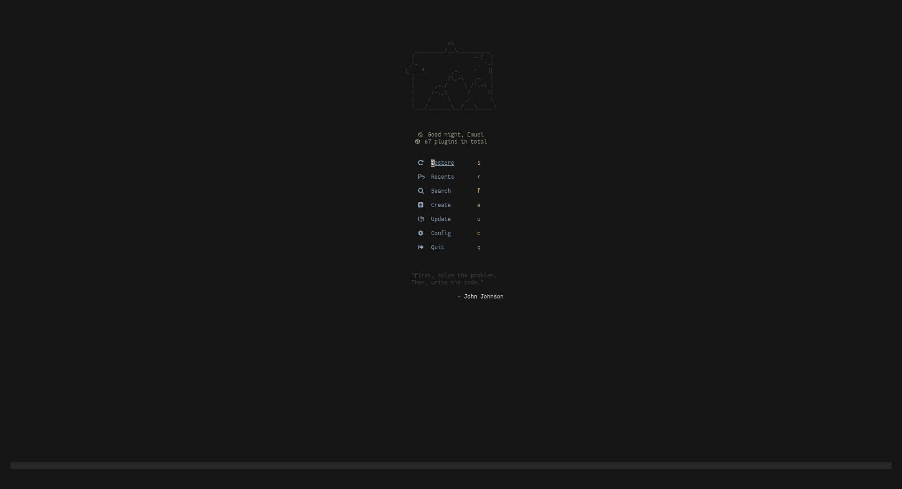
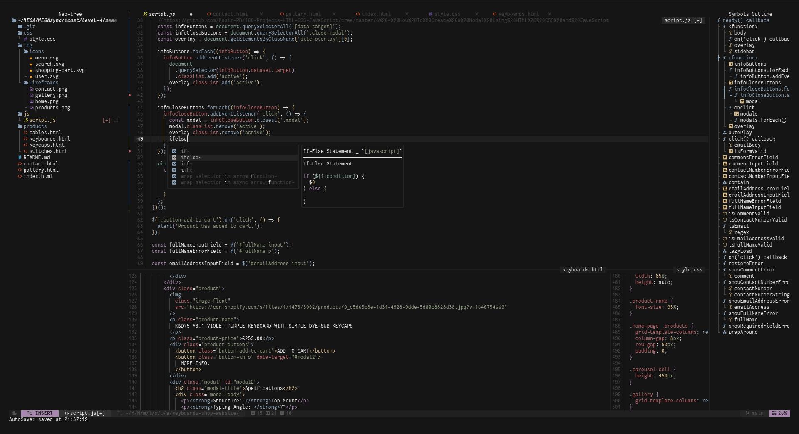

# [Emuel](https://github.com/emuel-vassallo)'s Neovim Config

    
    
    

## Showcase

## Credits

- mstcl's [Alpha config](https://github.com/mstcl/dotfiles/blob/main/.config/nvim/lua/configs/alpha.lua)
- chrisatmachine's Neovim-from-scratch [config](https://github.com/LunarVim/Neovim-from-scratch) and [playlist](https://www.youtube.com/watch?v=ctH-a-1eUME&list=PLhoH5vyxr6Qq41NFL4GvhFp-WLd5xzIzZ)
- bryant-the-coder's [NvHack](https://github.com/bryant-the-coder/NvHack)
- abzcoding's [lvim](https://github.com/abzcoding/lvim)
- max397574's [NeovimConfig](https://github.com/max397574/NeovimConfig)
